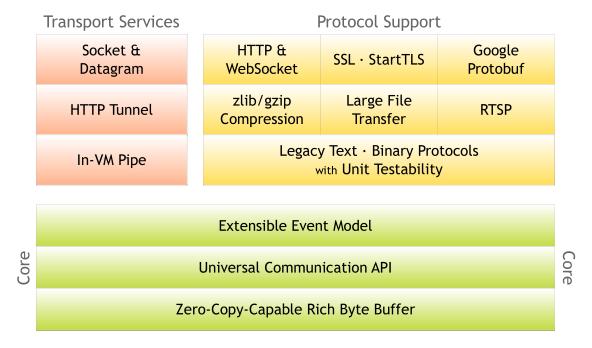

# Netty入门

## Netty介绍

[Netty官方文档](https://netty.io/index.html)

**Netty** 是一个异步事件驱动的网络应用程序框架，用于快速开发可维护的高性能协议服务器和客户端。

### Netty简介

**Netty** 是一个 **NIO** 客户端/服务器框架， 它能够快速便捷地开发网络应用框架，例如协议服务器和客户端。它极大地简化和优化了网络编程，例如 **TCP** 和 **UDP** 套接字服务器。

”快速便捷“并不意味着最终的应用程序会存在可维护性或性能问题。 **Netty** 的设计凝聚了众多协议（例如 **FTP**、**SMTP**、**HTTP**以及各种基于二进制和文本的传统协议）实现过程中积累的丰富经验。
因此，**Netty** 成功地在不牺牲任何性能的前提下，兼顾了开发便捷性、高性能、高稳定性和高灵活性。

### Netty优势

- 更高的吞吐量，更低的延迟
- 资源消耗更少
- 最大限度减少不必要的内存复制

## Netty入门

